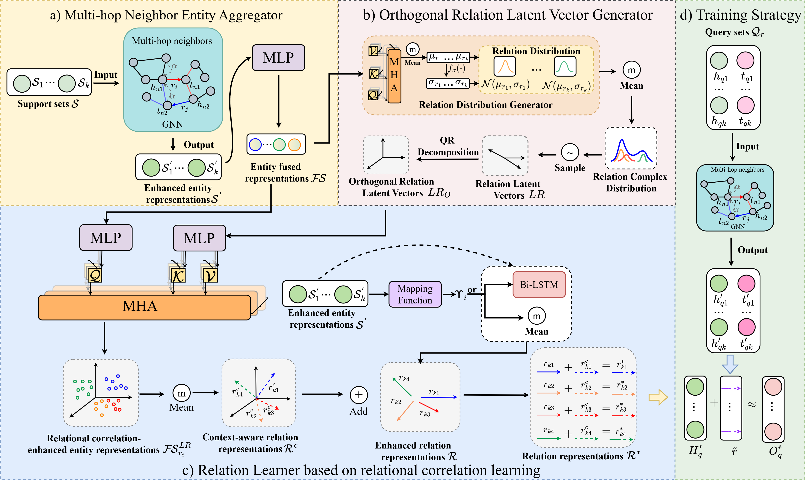

# Few-Shot Knowledge Graph Completion with Multi-Hop Aggregation and Relational Correlation Learning

## Abstract
> Few-shot knowledge graph completion (FKGC)  methods utilize a limited number of head-tail entity pairs to learn representations of unseen relations, thereby completing missing facts. However, most existing methods exhibit two issues: 1) These methods rely exclusively on the one-hop neighbors of entities, overlooking the richer information available from multi-hop neighbors, which hinders the accurate learning of relation representations. 2) During the relation representation learning process, existing methods presume that relations are mutually independent, disregarding their correlation, resulting in suboptimal FKGC performance. In fact, through the semantic analysis of relations on two public datasets, we find that the presumption of independence among these relations does not hold. To address these limitations, we propose a general FKGC method aggregating rich multi-hop neighbors and considering the correlation between relations. Specifically, enhanced entity representations (EER) are constructed by aggregating the multi-hop neighbor information of entities, effectively addressing the issue of insufficient contextual information resulting from the reliance on one-hop neighbors. Second, complex relation distributions are constructed to model the implicit correlations among relations, from which orthogonal relation latent vectors (ORLVs) are sampled to capture the semantic correlation between relations explicitly. Finally, a multi-head attention mechanism is employed to guide the fusion of relational correlation information from ORLVs with EER, further enhancing the accuracy of relation representations. Extensive comparative experiments on three public datasets demonstrate that our method significantly improves performance over state-of-the-art baselines.

<center>

</center>


[//]: # (Official code implementation for SIGIR 23 paper [Normalizing Flow-based Neural Process for Few-Shot Knowledge Graph Completion]&#40;https://arxiv.org/abs/2304.08183&#41;)
## Requirement
```
pytorch==1.11
tqdm==4.64
normflows==1.4
dgl==0.9.0
tensorboardx==2.5.1
```
Note: Please make sure `dgl==0.9.0` and use CUDA, our codes rely on a small [bug](https://github.com/dmlc/dgl/issues/4512#issuecomment-1250642930) of dgl for running.

## Environment
* python 3.8
* RTX 4096
* Memory 128G

## Dataset & Checkpoint
### Original Dataset
* [NELL](https://github.com/xwhan/One-shot-Relational-Learning)
* [FB15K-237](https://github.com/SongW-SW/REFORM)
* [YAGO3-10](https://github.com/pat-jj/KG-FIT)
### Processed Dataset
* [Dataset](https://drive.google.com/drive/u/0/folders/1vN1AMapGZaUnQ4c7gPiBmO_nB6vvhj1c)
* [Checkpoint](https://drive.google.com/drive/u/0/folders/1gpHkQDgr5KzAXptl_fa1pATvk__prYUc)

Download the datasets and extract to the project root folder.  

##  Train (1-shot and 5-shot)
### 1 MARC-NP-FKGC
* FB15K-237
```bash
cd ./MARC_NPFKGC
python main_SVD_complex_relation.py --dataset FB15K-One --data_path ../dataset/FB15K --epoch 10000 --few 1 --embed_dim 100 --latent_num 5 --data_form Pre-Train --prefix QR_CR_latent5_FB15Kfew1_exp1
python main_SVD_complex_relation.py --dataset FB15K-One --data_path ../dataset/FB15K --epoch 10000 --few 5 --embed_dim 100 --latent_num 5 --data_form Pre-Train --prefix QR_CR_latent5_FB15Kfew5_exp1
```

* NELL
```bash
cd ./MARC_NPFKGC
python main_SVD_complex_relation.py --dataset NELL-One --data_path ../dataset/Nell-HiRe --epoch 10000 --few 1 --embed_dim 100 --latent_num 5 --data_form Pre-Train --prefix QR_CR_latent5_Nellfew1_exp1
python main_SVD_complex_relation.py --dataset NELL-One --data_path ../dataset/Nell-HiRe --epoch 10000 --few 5 --embed_dim 100 --latent_num 5 --data_form Pre-Train --prefix QR_CR_latent5_Nellfew5_exp1
```
### 2 MARC-MetaR
* FB15K-237
```bash
cd ./MARC_NPFKGC
python main_MetaR_SVD_complex_relation.py --dataset FB15K-One --data_path ../dataset/FB15K --epoch 10000 --few 1 --embed_dim 100 --latent_num 5 --data_form Pre-Train --prefix MetaR_QR_CR_latent5_FB15Kfew1_exp1
python main_MetaR_SVD_complex_relation.py --dataset FB15K-One --data_path ../dataset/FB15K --epoch 10000 --few 5 --embed_dim 100 --latent_num 5 --data_form Pre-Train --prefix MetaR_QR_CR_latent5_FB15Kfew5_exp1
```

* NELL-One
```bash
cd ./MARC_NPFKGC
python main_MetaR_SVD_complex_relation.py --dataset NELL-One --data_path ../dataset/Nell-HiRe --epoch 10000 --few 1 --embed_dim 100 --latent_num 5 --data_form Pre-Train --prefix MetaR_QR_CR_latent5_Nellfew1_exp1
python main_MetaR_SVD_complex_relation.py --dataset NELL-One --data_path ../dataset/Nell-HiRe --epoch 10000 --few 5 --embed_dim 100 --latent_num 5 --data_form Pre-Train --prefix MetaR_QR_CR_latent5_Nellfew5_exp1
```
### 3 MARC-MetaR w/o MNEA
* FB15K-237
```bash
cd ./MARC_MetaR
python main_QR_complex_relation.py --dataset FB15K-One --data_path ./FB15K --epoch 10000 --few 1 --embed_dim 100 --latent_num 5 --data_form Pre-Train --prefix QR_CR_latent5_FB15K_few1_exp1
python main_QR_complex_relation.py --dataset FB15K-One --data_path ./FB15K --epoch 10000 --few 5 --embed_dim 100 --latent_num 5 --data_form Pre-Train --prefix QR_CR_latent5_FB15K_few5_exp1
```
* NELL-One
```bash
cd ./MARC_MetaR
python main_QR_complex_relation.py --dataset NELL-One --data_path ./Nell-HiRe --epoch 10000 --few 1 --embed_dim 100 --latent_num 5 --data_form Pre-Train --prefix MetaR_QR_CR_latent5_Nellfew1_exp1
python main_QR_complex_relation.py --dataset NELL-One --data_path ./Nell-HiRe --epoch 10000 --few 5 --embed_dim 100 --latent_num 5 --data_form Pre-Train --prefix MetaR_QR_CR_latent5_Nellfew5_exp1
```
* Wiki-One
```bash
cd ./MARC_MetaR
python main_QR_complex_relation.py --dataset Wiki-One --data_path ./Wiki --epoch 10000 --few 1 --embed_dim 50 --latent_num 5 --data_form Pre-Train --prefix MetaR_QR_CR_latent5_Wikifew1_exp1
python main_QR_complex_relation.py --dataset Wiki-One --data_path ./Wiki --epoch 10000 --few 5 --embed_dim 50 --latent_num 5 --data_form Pre-Train --prefix MetaR_QR_CR_latent5_Wikifew5_exp1
```

[//]: # (WIKI)

[//]: # (```bash)

[//]: # (python main.py --dataset Wiki-One --data_path ./Wiki --few 5 --data_form Pre-Train --prefix np_rgcn_attn_planar_wiki_5shot_intrain_g_batch_1024_eval_8 --device 0 --batch_size 64 --flow Planar -dim 50 --g_batch 1024 --eval_batch 8 --eval_epoch 4000)

[//]: # (```)


## Eval (1-shot and 5-shot)
Download the checkpoint and extract to the `state/` folder.
### 1 MARC-NP-FKGC
* FB15K-237
```bash
cd ./MARC_NPFKGC
python main_SVD_complex_relation.py --dataset FB15K-One --data_path --epoch 10000 ../dataset/FB15K --few 1 --embed_dim 100 --latent_num 5 --data_form Pre-Train --prefix QR_CR_latent5_FB15Kfew1_exp1 --step test
python main_SVD_complex_relation.py --dataset FB15K-One --data_path --epoch 10000 ../dataset/FB15K --few 5 --embed_dim 100 --latent_num 5 --data_form Pre-Train --prefix QR_CR_latent5_FB15Kfew5_exp1 --step test
```

* NELL
```bash
cd ./MARC_NPFKGC
python main_SVD_complex_relation.py --dataset NELL-One --data_path --epoch 10000 ../dataset/Nell-HiRe --few 1 --embed_dim 100 --latent_num 5 --data_form Pre-Train --prefix QR_CR_latent5_Nellfew1_exp1 --step test
python main_SVD_complex_relation.py --dataset NELL-One --data_path --epoch 10000 ../dataset/Nell-HiRe --few 5 --embed_dim 100 --latent_num 5 --data_form Pre-Train --prefix QR_CR_latent5_Nellfew5_exp1 --step test
```
### 2 MARC-MetaR
* FB15K-237
```bash
cd ./MARC_NPFKGC
python main_MetaR_SVD_complex_relation.py --dataset FB15K-One --data_path ../dataset/FB15K 10000 --few 1 --embed_dim 100 --latent_num 5 --data_form Pre-Train --prefix MetaR_QR_CR_latent5_FB15Kfew1_exp1 --step test
python main_MetaR_SVD_complex_relation.py --dataset FB15K-One --data_path ../dataset/FB15K 10000 --few 5 --embed_dim 100 --latent_num 5 --data_form Pre-Train --prefix MetaR_QR_CR_latent5_FB15Kfew5_exp1 --step test
```

* NELL
```bash
cd ./MARC_NPFKGC
python main_MetaR_SVD_complex_relation.py --dataset NELL-One --data_path ../dataset/Nell-HiRe --few 1 --embed_dim 100 --latent_num 5 --data_form Pre-Train --prefix MetaR_QR_CR_latent5_Nellfew1_exp1  --step test
python main_MetaR_SVD_complex_relation.py --dataset NELL-One --data_path ../dataset/Nell-HiRe  --few 5 --embed_dim 100 --latent_num 5 --data_form Pre-Train --prefix MetaR_QR_CR_latent5_Nellfew5_exp1 --step test
```

### 3 MARC-MetaR w/o MNEA
* FB15K-237
```bash
cd ./MARC_MetaR
python main_QR_complex_relation.py --dataset FB15K-One --data_path ./FB15K --few 1 --embed_dim 100 --latent_num 5 --data_form Pre-Train --prefix QR_CR_latent5_FB15K_few1_exp1 --eval_ckpt 1000 --step test 
python main_QR_complex_relation.py --dataset FB15K-One --data_path ./FB15K  --few 5 --embed_dim 100 --latent_num 5 --data_form Pre-Train --prefix QR_CR_latent5_FB15K_few5_exp1 --eval_ckpt 1000 --step test
```
* NELL
```bash
cd ./MARC_MetaR
python main_QR_complex_relation.py --dataset NELL-One --data_path ./Nell-HiRe --few 1 --embed_dim 100 --latent_num 5 --data_form Pre-Train --prefix MetaR_QR_CR_latent5_Nellfew1_exp1 --eval_ckpt 1000 --step test 
python main_QR_complex_relation.py --dataset NELL-One --data_path ./Nell-HiRe   --few 5 --embed_dim 100 --latent_num 5 --data_form Pre-Train --prefix MetaR_QR_CR_latent5_Nellfew5_exp1 --eval_ckpt 1000 --step test
```
* Wiki-One
```bash
cd ./MARC_MetaR
python main_QR_complex_relation.py --dataset Wiki-One --data_path ./Wiki --few 1 --embed_dim 50 --latent_num 5 --data_form Pre-Train --prefix MetaR_QR_CR_latent5_Wikifew1_exp1 --eval_ckpt 1000 --step test 
python main_QR_complex_relation.py --dataset Wiki-One --data_path ./Wiki   --few 5 --embed_dim 50 --latent_num 5 --data_form Pre-Train --prefix MetaR_QR_CR_latent5_Wikifew5_exp1  --eval_ckpt 1000 --step test 
``` 

[//]: # (WIKI)

[//]: # (```bash)

[//]: # (python main.py --dataset Wiki-One --data_path ./Wiki --few 5 --data_form Pre-Train --prefix np_rgcn_attn_planar_wiki_5shot_intrain_g_batch_1024_eval_8_0.503 --device 0 --batch_size 64 --flow Planar -dim 50 --g_batch 1024 --eval_batch 8 --eval_epoch 4000 --step test)

[//]: # (```)


## Results
### 1-shot FKGC results
* MARC-NP-FKGC

| Dataset | MRR   | Hits@10 | Hits@5 | Hits@1 |
| ------- | ----- | ------- | ------ | ------ |
| FB15K-237   | 0.555 | 0.787   | 0.729  | 0.401 |
| NELL    | 0.464 | 0.530   | 0.506  | 0.429  |

* MARC-MetaR

| Dataset | MRR   | Hits@10 | Hits@5 | Hits@1 |
| ------- |-------|---------|--------|--------|
| FB15K-237   | 0.507 | 0.675   | 0.621  | 0.409  |
| NELL    | 0.314 | 0.388   | 0.340  | 0.276  |


### 5-shot FKGC results
* MARC-NP-FKGC

| Dataset | MRR   | Hits@10 | Hits@5 | Hits@1 |
| ------- | ----- | ------- | ------ | ------ |
| FB15K-237   | 0.590 | 0.827   | 0.759  | 0.452 |
| NELL    | 0.437 | 0.507   | 0.473  | 0.400  |

* MARC-MetaR

| Dataset | MRR   | Hits@10 | Hits@5 | Hits@1 |
| ------- |-------|---------|--------|--------|
| FB15K-237   | 0.542 | 0.753   | 0.695  | 0.415  |
| NELL    | 0.390 | 0.436   | 0.411  | 0.359  |


See the full results in our paper.

[//]: # (## Citations)

[//]: # (If you use this repo, please cite the following paper.)

[//]: # (```)

[//]: # (@inproceedings{luo2023npfkgc,)

[//]: # (  title     = {Normalizing Flow-based Neural Process for Few-Shot Knowledge Graph Completion},)

[//]: # (  author    = {Luo, Linhao and Li, Yuan-Fang and Haffari, Gholamreza and Pan, Shirui},)

[//]: # (  booktitle = {The 46th International ACM SIGIR Conference on Research and Development in Information Retrieval},)

[//]: # (  year      = {2023})

[//]: # (})

[//]: # (```)


## Acknowledgement
This repo is mainly based on [NP-FKGC](https://github.com/RManLuo/NP-FKGC) and [MetaR](https://github.com/AnselCmy/MetaR). We thank the authors for their great works.
